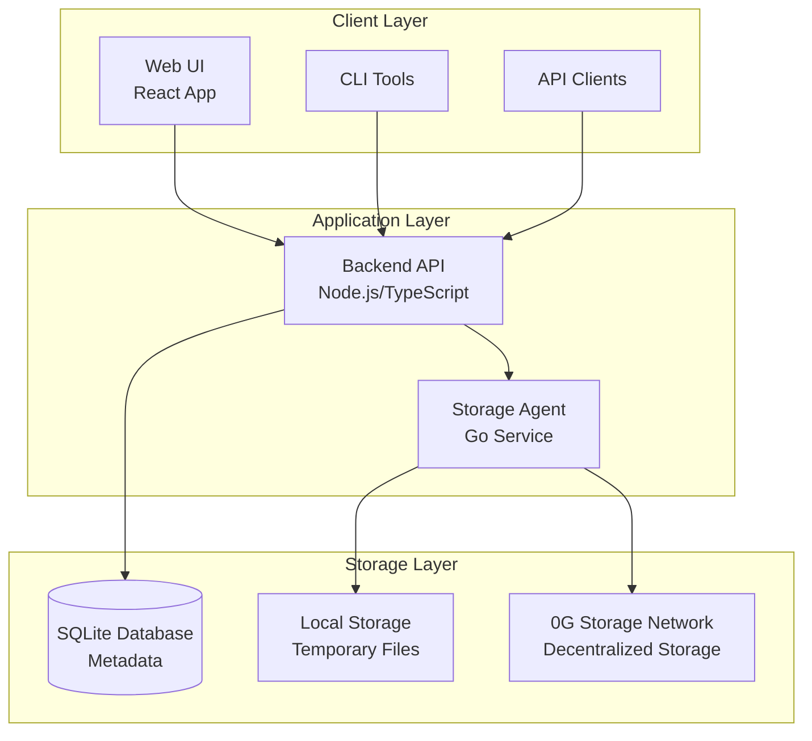
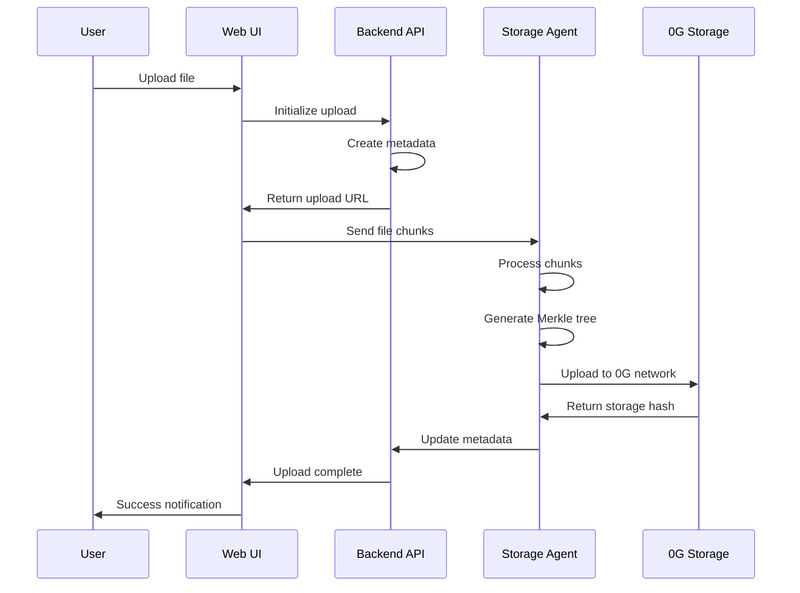
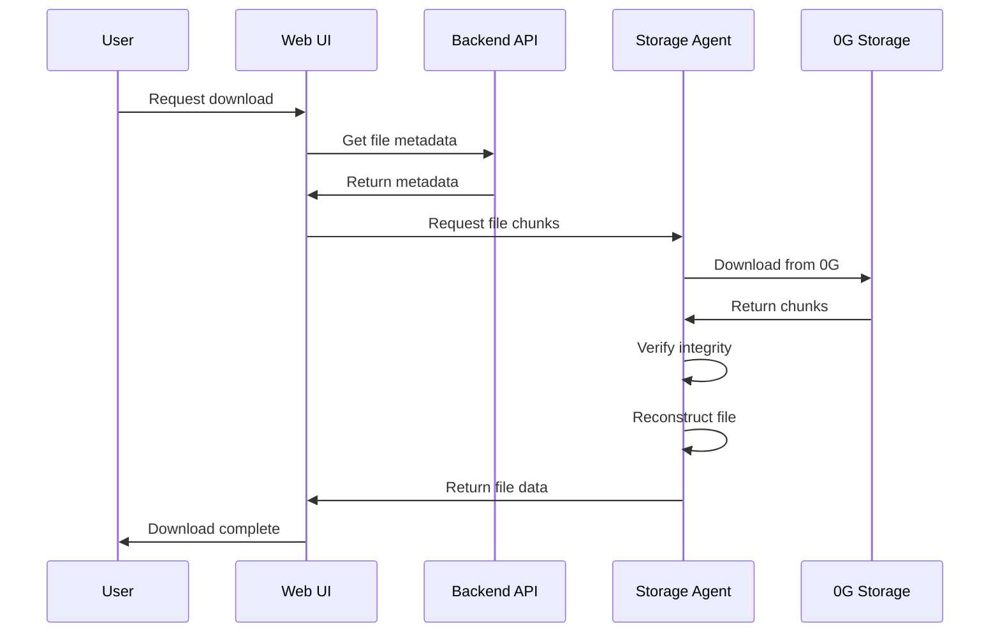

# NebularVault Architecture

## Overview

NebularVault is a decentralized file storage system built on the 0G Storage network. It implements a microservices architecture with three main components working together to provide secure, scalable file storage.

## System Architecture

## Component Details

### 1. Web UI (React Application)
- **Port**: 3000
- **Technology**: React 18, TypeScript, Tailwind CSS
- **Features**:
  - Drag-and-drop file upload
  - File management interface
  - Real-time upload progress
  - User authentication
  - Responsive design

### 2. Backend API (Node.js Service)
- **Port**: 4000
- **Technology**: Node.js, Express.js, TypeScript, SQLite
- **Features**:
  - RESTful API endpoints
  - JWT authentication
  - File metadata management
  - User management
  - Rate limiting and security
  - Database operations

### 3. Storage Agent (Go Service)
- **Port**: 8080
- **Technology**: Go 1.22, Gin framework
- **Features**:
  - File chunking and reconstruction
  - Merkle tree generation
  - 0G Storage integration
  - Cryptographic verification
  - Storage optimization

## Data Flow

### File Upload Process

### File Download Process

## Security Architecture

### Authentication & Authorization
- **JWT Tokens**: Stateless authentication
- **Role-based Access**: User permissions
- **API Key Management**: Secure key storage

### Data Protection
- **File Encryption**: Client-side encryption before upload
- **Merkle Tree Verification**: Cryptographic integrity checks
- **Secure Communication**: HTTPS/TLS for all communications
- **Input Validation**: Comprehensive request validation

### Network Security
- **Rate Limiting**: Protection against abuse
- **CORS Configuration**: Cross-origin request control
- **Security Headers**: Helmet.js protection
- **Firewall Rules**: Network-level protection

## Storage Architecture

### File Chunking Strategy
- **Chunk Size**: Configurable (default: 1KB)
- **Parallel Processing**: Concurrent chunk uploads
- **Error Recovery**: Retry mechanisms for failed chunks
- **Progress Tracking**: Real-time upload progress

### Merkle Tree Implementation
- **Tree Structure**: Binary tree for efficient verification
- **Root Hash**: Single hash representing entire file
- **Proof Generation**: Cryptographic proofs for each chunk
- **Integrity Verification**: Automatic integrity checks

### 0G Storage Integration
- **Network Access**: Direct integration with 0G API
- **Redundancy**: Multiple storage nodes
- **Geographic Distribution**: Global storage network
- **Cost Optimization**: Efficient storage utilization

## Scalability Considerations

### Horizontal Scaling
- **Load Balancing**: Multiple backend instances
- **Database Sharding**: Distributed metadata storage
- **Agent Clustering**: Multiple storage agents
- **CDN Integration**: Global content delivery

### Performance Optimization
- **Caching**: Redis for session and metadata caching
- **Compression**: Gzip compression for API responses
- **Connection Pooling**: Database connection optimization
- **Async Processing**: Non-blocking file operations

## Monitoring & Observability

### Health Checks
- **Service Health**: Individual component health monitoring
- **Dependency Health**: External service status
- **Resource Monitoring**: CPU, memory, disk usage
- **Network Monitoring**: Latency and throughput metrics

### Logging Strategy
- **Structured Logging**: JSON-formatted logs
- **Log Levels**: Debug, info, warn, error
- **Centralized Logging**: ELK stack integration
- **Audit Trails**: Security and access logging

### Metrics Collection
- **Application Metrics**: Custom business metrics
- **System Metrics**: Infrastructure monitoring
- **User Metrics**: Usage patterns and analytics
- **Performance Metrics**: Response times and throughput

## Deployment Architecture

### Containerization
- **Docker Images**: Optimized multi-stage builds
- **Docker Compose**: Local development environment
- **Kubernetes**: Production orchestration
- **Health Checks**: Container health monitoring

### Infrastructure
- **Cloud Providers**: AWS, GCP, Azure support
- **Load Balancers**: Application load balancing
- **Auto Scaling**: Dynamic resource allocation
- **Backup Strategy**: Data backup and recovery

## Future Enhancements

### Planned Features
- **Multi-chain Support**: Additional blockchain networks
- **Advanced Encryption**: End-to-end encryption
- **File Versioning**: Version control for files
- **Collaborative Features**: Multi-user file sharing

### Technical Improvements
- **GraphQL API**: More flexible API queries
- **WebSocket Support**: Real-time updates
- **Mobile Apps**: Native mobile applications
- **Edge Computing**: Distributed processing
